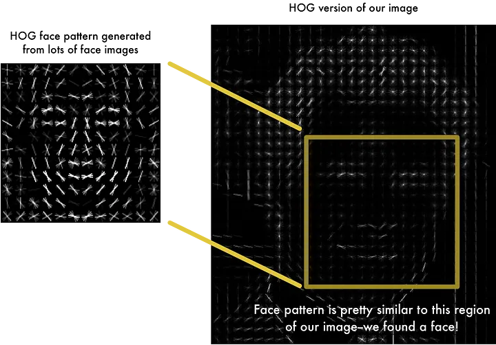
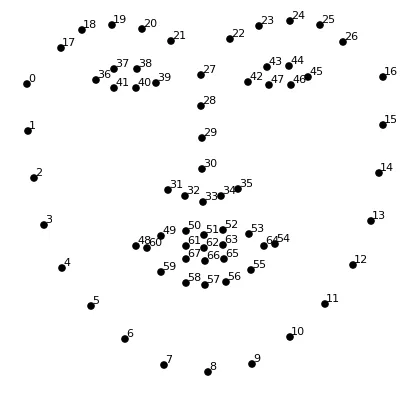
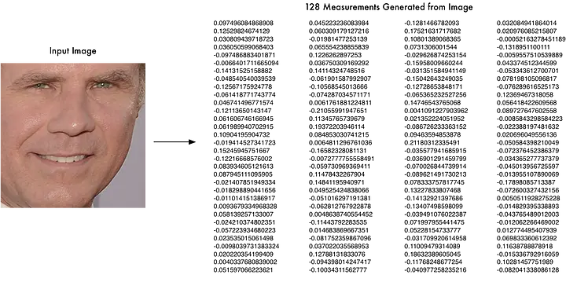

Репозиторий для тестирования библиотек и алгоритмов распознавания лица. 
---

#### Автор репозитория:
Davron Ikhmatullaev  [Телеграм](https://t.me/ihmatullaev)  [LinkedIn](https://www.linkedin.com/in/davron-ikhmatullaev/)

## 1й Этап.

##### Проверка сборки библиотек OpenCV и face_recognition

Ссылки на полезные материалы:
1. [Репозиторий face_recognition](https://github.com/ageitgey/face_recognition/) 
2. [Статья по внутренней работе библиотеки face_recognition](https://medium.com/@ageitgey/machine-learning-is-fun-part-4-modern-face-recognition-with-deep-learning-c3cffc121d78)
3. [Face Recognition Pipeline Clearly Explained](https://medium.com/backprop-labs/face-recognition-pipeline-clearly-explained-f57fc0082750)
4. [Распознавание лиц: подробное объяснение бумаги "Arcface"](https://russianblogs.com/article/51201299672/)
---

#### Как работает эта сборка?!

Распознавание лиц делится на четыре процесса: обнаружение лиц, выравнивание лиц, извлечение признаков и сопоставление признаков

1. Поиск и нахождение лиц на фотографиях по алгоритму [HOG](https://lear.inrialpes.fr/people/triggs/pubs/Dalal-cvpr05.pdf).

2. Поиск опорных точек на лице по [методологии от 2014 года](http://www.csc.kth.se/~vahidk/papers/KazemiCVPR14.pdf) и выравнивание лица в нужное направление (для изображений где лицо видно боком).

3. Извлечение признаков. Перевод изображения лица в embedding (набор чисел - вектор) [при помощи нейронной сети](http://www.cv-foundation.org/openaccess/content_cvpr_2015/app/1A_089.pdf). В итоге каждое лицо преобразуется в вектор из 128 последовательных чисел.

4. Запоминаем эмбеддинги лиц при помощи метки изображений. 
5. Любое неизвестное лицо можно классифицировать при помощи измерения евклидово расстояния либо классической МЛ модели (например [SVM](https://en.wikipedia.org/wiki/Support_vector_machine)).

---
#### Примеры реализации сборки:

1. Распознование лиц в видеофайле. Сохранение видео. [Ссылка](https://github.com/ageitgey/face_recognition/blob/master/examples/facerec_from_video_file.py)
2. Обучение модели SVC (классификатор по методу опорных векторов) на наборе изображений. [Ссылка](https://github.com/ageitgey/face_recognition/blob/master/examples/face_recognition_svm.py)
3. Обучение модели KNN (классификатор по методу ближайщих сосдей) на наборе изображений. [Ссылка](https://github.com/ageitgey/face_recognition/blob/master/examples/face_recognition_knn.py)
4. Распознование лиц по вебкамере. [Ссылка](https://github.com/ageitgey/face_recognition/blob/master/examples/facerec_from_webcam.py)

## 2й Этап.

##### Проверка сборки библиотек OpenCV и deepface

